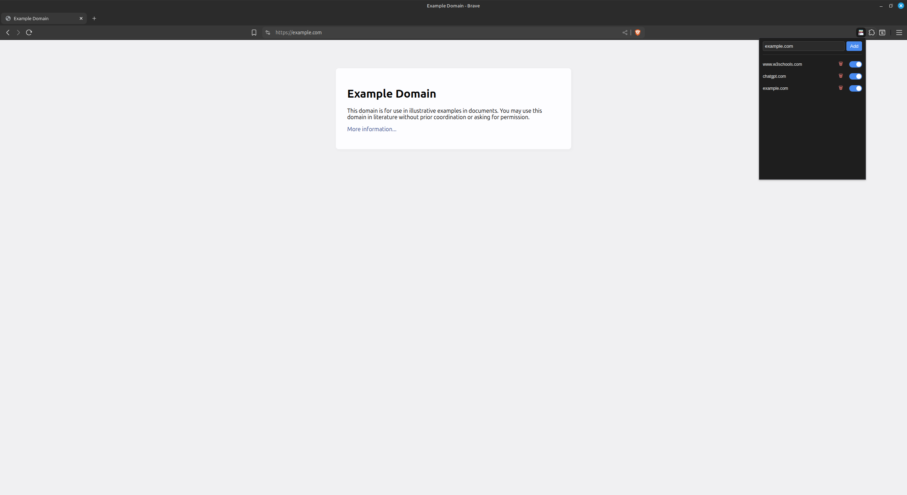

# NoTab

Blocks selected websites from opening new tabs. Manage a custom domain blocklist via popup UI.

## Features

- Prevents tab popups
- Domain allow/block list
- Simple UI, persistent storage

## Install

1. Go to `chrome://extensions/`
2. Enable **Developer mode**
3. Click **Load unpacked** and select the folder

## Screenshot

